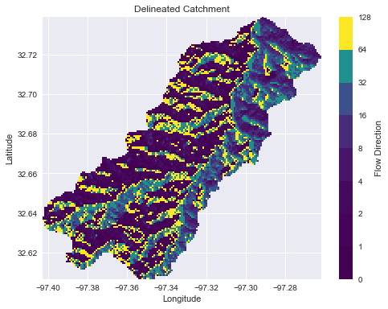
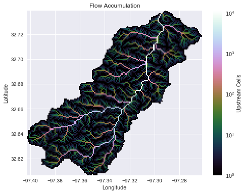
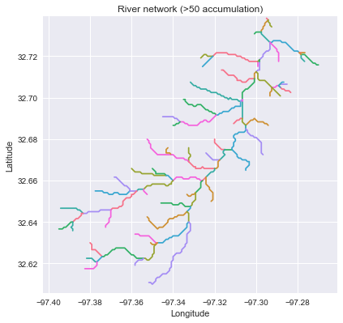

# pysheds [](https://travis-ci.org/mdbartos/pysheds)
Simple and fast watershed delineation in python.

## Example usage

See [examples/quickstart](https://github.com/mdbartos/pysheds/blob/master/examples/quickstart.ipynb) for more details.

Data available via the [USGS HydroSHEDS](https://hydrosheds.cr.usgs.gov/datadownload.php) project.

```python
    # Read elevation and flow direction rasters
    # ----------------------------
    from pysheds.grid import Grid

    grid = Grid.from_raster('n30w100_con', data_name='dem')
    grid.read_raster('n30w100_dir', data_name='dir')
```


```python
    # Delineate a catchment
    # ---------------------
    # Specify pour point
    x, y = -97.294167, 32.73750
    # Specify directional mapping
    dirmap=(64, 128, 1, 2, 4, 8, 16, 32)

    # Delineate the catchment
    grid.catchment(data='dir', x=x, y=y, dirmap=dirmap, out_name='catch',
               recursionlimit=15000, xytype='label')

    # Crop and plot the catchment
    # ---------------------------
    # Clip the bounding box to the catchment
    grid.clip_to('catch')
```



```python
    # Calculate flow accumulation
    # --------------------------
    grid.accumulation(data='catch', dirmap=dirmap, out_name='acc')
```



```python
    # Calculate distance to outlet from each cell
    # -------------------------------------------
    grid.flow_distance(data='catch', x=x, y=y, dirmap=dirmap,
                   out_name='dist', xytype='label')
```


```python
    # Extract river network
    # ---------------------
    branches, yx = grid.extract_river_network(fdir='catch', acc='acc',
                                              threshold=50, dirmap=dirmap)
```




## Features

- Hydrologic Functions:
  - `flowdir`: DEM to flow direction.
  - `catchment`: Delineate catchment from flow direction.
  - `accumulation`: Flow direction to flow accumulation.
  - `flow_distance`: Compute flow distance to outlet.
  - `resolve_flats`: Resolve flats in a DEM using the modified method of Garbrecht and Martz (1997).
  - `fraction`: Compute fractional contributing area between differently-sized grids.
  - `extract_river_network`: Extract river network at a given accumulation threshold.
  - `cell_area`: Compute (projected) area of cells.
  - `cell_distances`: Compute (projected) channel length within cells.
  - `cell_dh`: Compute the elevation change between cells.
  - `cell_slopes`: Compute the slopes of cells.
- Utilities
  - `read_ascii`: Reads ascii gridded data.
  - `read_raster`: Reads raster gridded data.
  - `to_crs`: Converts the coordinate reference system of the grid.
  - `to_ascii`: Write grids to ascii files.

`pysheds` currently only supports a d8 routing scheme

## Installation

`pysheds` currently only supports Python 3

```bash
    $ git clone https://github.com/mdbartos/pysheds.git
    $ cd pysheds
    $ python setup.py install
```


# Performance
Performance benchmarks on a 2015 MacBook Pro:

- Flow Direction to Flow Accumulation: 36 million grid cells in 15 seconds.
- Flow Direction to Catchment: 9.8 million grid cells in 4.55 seconds.
