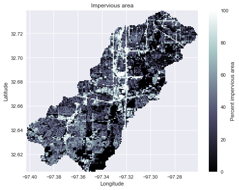
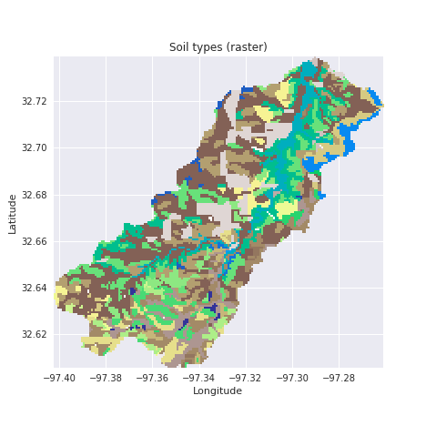

# pysheds [](https://travis-ci.org/mdbartos/pysheds)
🌎 Simple and fast watershed delineation in python.

## Example usage

See [examples/quickstart](https://github.com/mdbartos/pysheds/blob/master/examples/quickstart.ipynb) for more details.

Data available via the [USGS HydroSHEDS](https://hydrosheds.cr.usgs.gov/datadownload.php) project.

```python
    # Read elevation and flow direction rasters
    # ----------------------------
    from pysheds.grid import Grid

    grid = Grid.from_raster('n30w100_con', data_name='dem')
    grid.read_raster('n30w100_dir', data_name='dir')
    grid.view('dem')
```


```python
    # Determine D8 flow directions from DEM
    # ----------------------
    # Resolve flats in DEM
    grid.resolve_flats('dem', out_name='inflated_dem')
    
    # Specify directional mapping
    dirmap = (64, 128, 1, 2, 4, 8, 16, 32)
    
    # Compute flow directions
    # -------------------------------------
    grid.flowdir(data='inflated_dem', out_name='dir', dirmap=dirmap)
    grid.view('dir')
```


```python
    # Delineate a catchment
    # ---------------------
    # Specify pour point
    x, y = -97.294167, 32.73750

    # Delineate the catchment
    grid.catchment(data='dir', x=x, y=y, dirmap=dirmap, out_name='catch',
               recursionlimit=15000, xytype='label')

    # Crop and plot the catchment
    # ---------------------------
    # Clip the bounding box to the catchment
    grid.clip_to('catch')
    grid.view('catch')
```


```python
    # Calculate flow accumulation
    # --------------------------
    grid.accumulation(data='catch', dirmap=dirmap, out_name='acc')
    grid.view('acc')
```


```python
    # Calculate distance to outlet from each cell
    # -------------------------------------------
    grid.flow_distance(data='catch', x=x, y=y, dirmap=dirmap,
                   out_name='dist', xytype='label')
    grid.view('dist')
```


```python
    # Extract river network
    # ---------------------
    branches = grid.extract_river_network(fdir='catch', acc='acc',
                                          threshold=50, dirmap=dirmap)
```


```python
    # Combine with land cover data
    # ---------------------
    grid.read_raster('nlcd_2011_impervious_2011_edition_2014_10_10.img',
                      data_name='terrain', window=grid.bbox, window_crs=grid.crs)
    grid.view('terrain')
```



```python
    # Convert catchment raster to vector and combine with soils shapefile
    # ---------------------
    # Read soils shapefile
    import geopandas as gpd
    from shapely import geometry, ops
    soils = gpd.read_file('nrcs-soils-tarrant_439.shp')
    # Convert catchment raster to vector geometry and find intersection
    shapes = grid.polygonize()
    catchment_polygon = ops.unary_union([geometry.shape(shape)
                                         for shape, value in shapes])
    soils = soils[soils.intersects(catchment_polygon)]
    catchment_soils = soils.intersection(catchment_polygon)
```


```python
    # Convert soils polygons to raster
    # ---------------------
    soil_polygons = zip(catchment_soils.geometry.values,
                        catchment_soils['soil_type'].values)
    soil_raster = grid.rasterize(soil_polygons, fill=np.nan)
```



## Features

- Hydrologic Functions:
  - `flowdir`: DEM to flow direction.
  - `catchment`: Delineate catchment from flow direction.
  - `accumulation`: Flow direction to flow accumulation.
  - `flow_distance`: Compute flow distance to outlet.
  - `fraction`: Compute fractional contributing area between differently-sized grids.
  - `extract_river_network`: Extract river network at a given accumulation threshold.
  - `cell_area`: Compute (projected) area of cells.
  - `cell_distances`: Compute (projected) channel length within cells.
  - `cell_dh`: Compute the elevation change between cells.
  - `cell_slopes`: Compute the slopes of cells.
  - `fill_pits`: Fill simple pits in a DEM (single cells lower than their surrounding neighbors).
  - `fill_depressions`: Fill depressions in a DEM (regions of cells lower than their surrounding neighbors).
  - `resolve_flats`: Resolve drainable flats in a DEM using the modified method of Garbrecht and Martz (1997).
  - `raise_nondraining_flats`: Raise non-draining flats to the elevation of their lowest neighbor.
- Utilities:
  - `view`: Returns a view of a dataset at a given bounding box and resolution.
  - `clip_to`: Clip the current view to the extent of nonzero values in a given dataset.
  - `snap_to_mask`: Snap a set of coordinates to the nearest masked cells (e.g. cells with high accumulation).
  - `resize`: Resize a dataset to a new resolution.
  - `rasterize`: Convert a vector dataset to a raster dataset.
  - `polygonize`: Convert a raster dataset to a vector dataset.
  - `detect_pits`: Return boolean array indicating locations of simple pits in a DEM.
  - `detect_flats`: Return boolean array indicating locations of flats in a DEM.
  - `detect_nondraining_flats`: Return boolean array indicating locations of nondraining flats in a DEM.
  - `check_cycles`: Check for cycles in a flow direction grid.
  - `set_nodata`: Set nodata value for a dataset.
- I/O:
  - `read_ascii`: Reads ascii gridded data.
  - `read_raster`: Reads raster gridded data.
  - `to_ascii`: Write grids to delimited ascii files.
  - `to_raster`: Write grids to raster files (e.g. geotiff).

`pysheds` currently only supports a d8 routing scheme

## Installation

`pysheds` currently only supports Python 3.

You can install `pysheds` using pip:

```bash
pip install pysheds
```

For the bleeding-edge version, you can install pysheds from this github repository.

```bash
    $ git clone https://github.com/mdbartos/pysheds.git
    $ cd pysheds
    $ python setup.py install
```

or

```bash
    $ git clone https://github.com/mdbartos/pysheds.git
    $ cd pysheds
    $ pip install .
```

# Performance
Performance benchmarks on a 2015 MacBook Pro:

- Flow Direction to Flow Accumulation: 36 million grid cells in 15 seconds.
- Flow Direction to Catchment: 9.8 million grid cells in 4.55 seconds.
