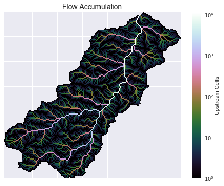
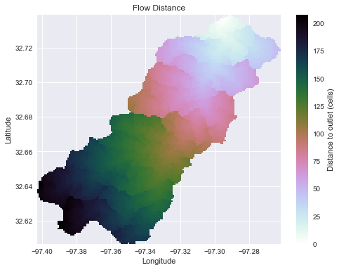

# pysheds
Simple and fast watershed delineation in python.

## Installation

`pysheds` currently only supports Python3

```bash
    $ git clone https://github.com/mdbartos/pysheds.git
    $ cd pysheds
    $ python setup.py install
```

## Features

- Flow Direction to Flow Accumulation
- Catchment delineation from Flow Direction
- Distance to outlet
- Fractional contributing area between differently-sized grids
- Read/write raster or ASCII files

`pysheds` currently only supports a d8 routing scheme

## Example usage

See examples/quickstart for more details.

```python
    # Read a flow direction raster
    # ----------------------------
    from pysheds.grid import Grid

    grid = Grid.from_raster('../data/n30w100_dir/n30w100_dir/w001001.adf',
                            data_name='dir', input_type='ascii')
```


```python
    # Delineate a catchment
    # ---------------------
    # Specify pour point
    x, y = -97.2937, 32.7371
    # Specify directional mapping
    dirmap=(64, 128, 1, 2, 4, 8, 16, 32)

    # Delineate the catchment
    grid.catchment(x, y, dirmap=dirmap, recursionlimit=15000,
                   xytype='label')

    # Crop and plot the catchment
    # ---------------------------
    # Clip the bounding box to the catchment
    grid.clip_to('catch', precision=5)
```


```python
    # Calculate flow accumulation
    # --------------------------
    grid.accumulation(catch, dirmap=dirmap, pad_inplace=False)
```



```python
    # Calculate distance to outlet from each cell
    # -------------------------------------------
    pour_point_y, pour_point_x = np.unravel_index(np.argmax(grid.view('catch')),
                                                  grid.shape)
    grid.flow_distance(pour_point_x, pour_point_y, dirmap=dirmap)
```



# Performance
Performance benchmarks on a 2015 MacBook Pro:

- Flow Direction --> Flow Accumulation: 36 million grid cells in 15 seconds.
- Flow Direction --> Catchment: 9.8 million grid cells in 4.55 seconds.

# To-do's:
- DEM to Flow Direction doesn't handle flats
- Float-based bbox indexing is problematic
- Add graph routines
- Allow conversion of CRS
- Extract river topology from flow accumulation
- Raster to vector conversion and shapefile output
